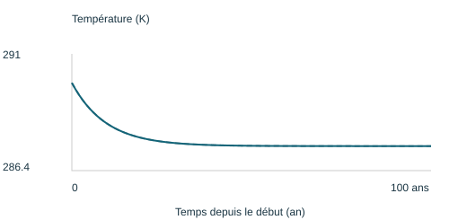
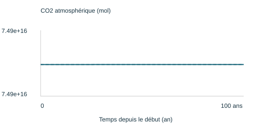
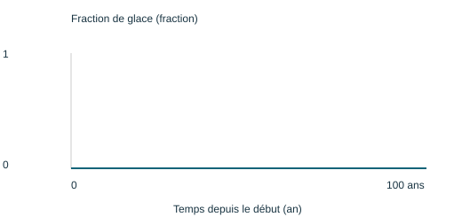
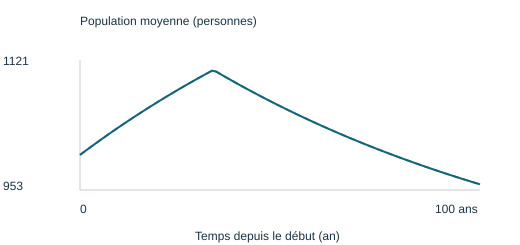
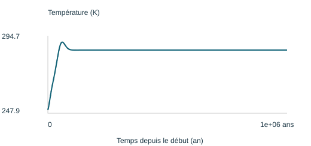
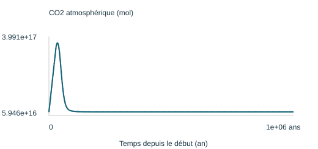
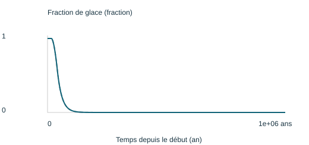
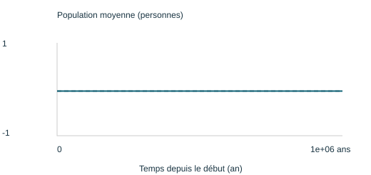

# Le monde calculé par la version commune

Version du moteur : `c41ab9f89aae`. Routines et origines : voir le module commun. Les contributions locales non validées ne modifient pas ces résultats.

## societe

Durée : 100 ans ; pas : 1 ans. T finale : 287.42 K ; glace : 0.00 %.

[Données de cette simulation](societe.json) · [Rapport HTML à télécharger](societe.html)

Les deux lignes du rapport sont identiques dans ces exemples communs. Dans un cahier élève, elles comparent le moteur de référence et sa routine locale.

## deglaciation

Durée : 1e+06 ans ; pas : 1000 ans. T finale : 287.56 K ; glace : 0.00 %.

[Données de cette simulation](deglaciation.json) · [Rapport HTML à télécharger](deglaciation.html)

Les deux lignes du rapport sont identiques dans ces exemples communs. Dans un cahier élève, elles comparent le moteur de référence et sa routine locale.

## Limites

Ce sont les scénarios du moteur annuel/itératif des douze routines, pas une évolution de cinq milliards d’années. Le cycle hydrologique géologique appartient au notebook collectif distinct. Les références professeur restent signalées jusqu’à remplacement validé.
